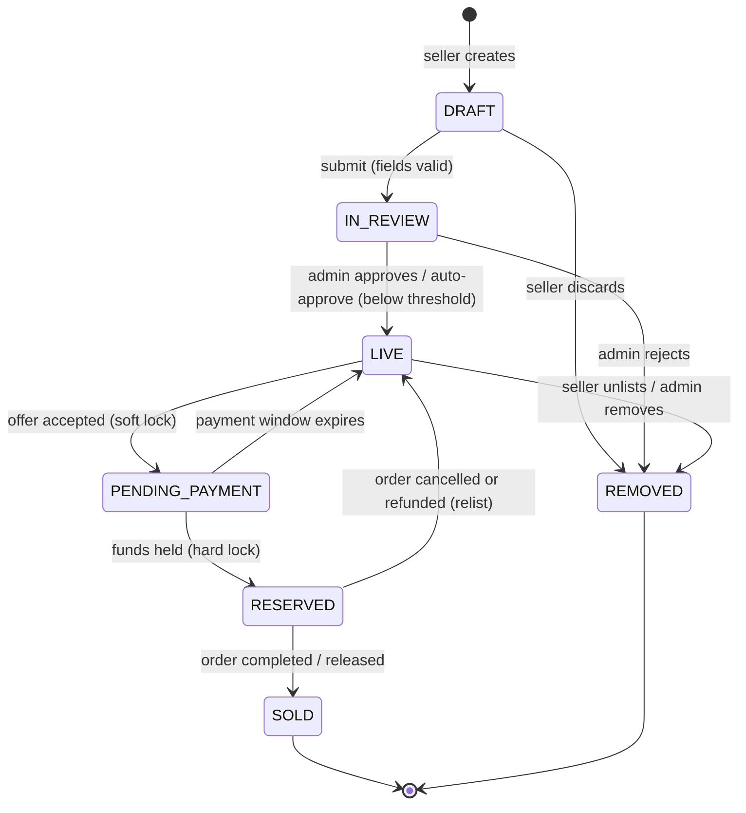
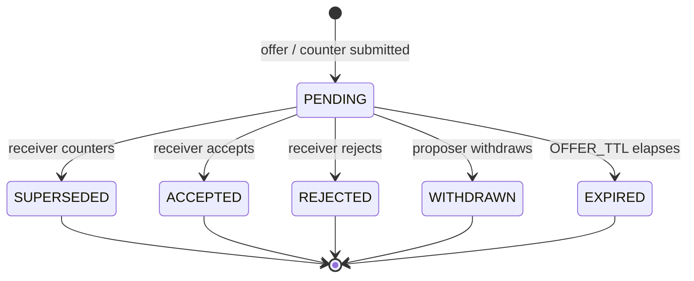
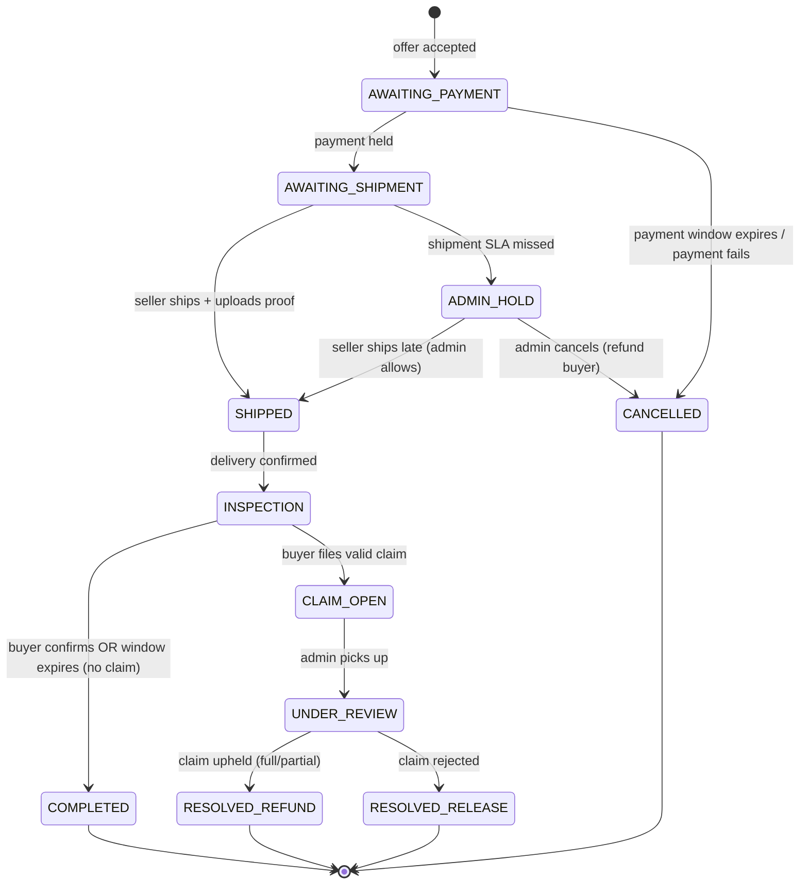
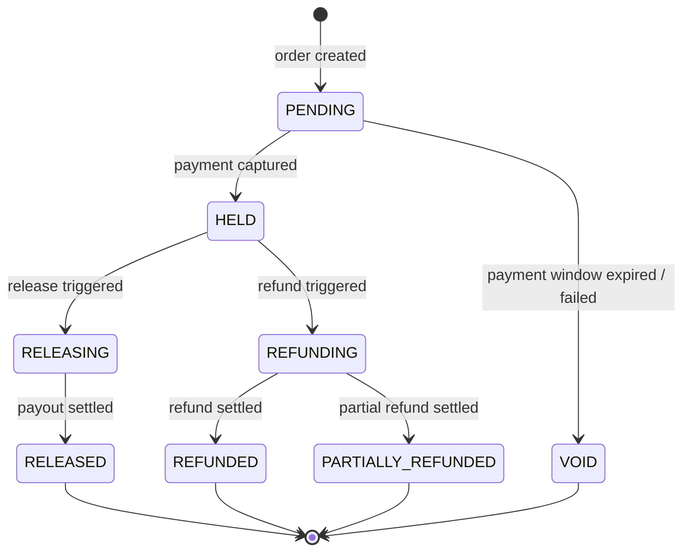
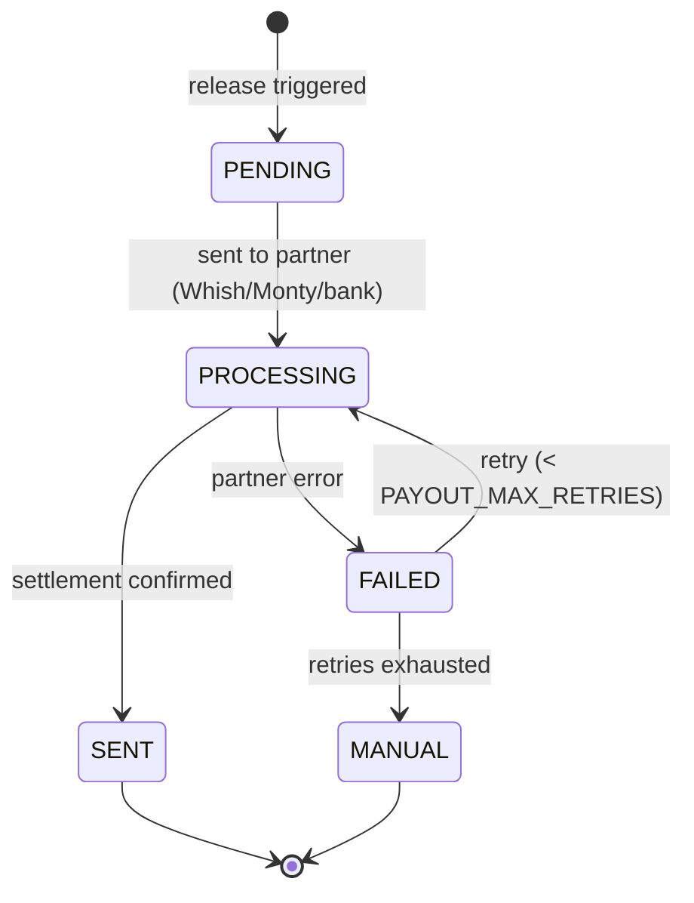
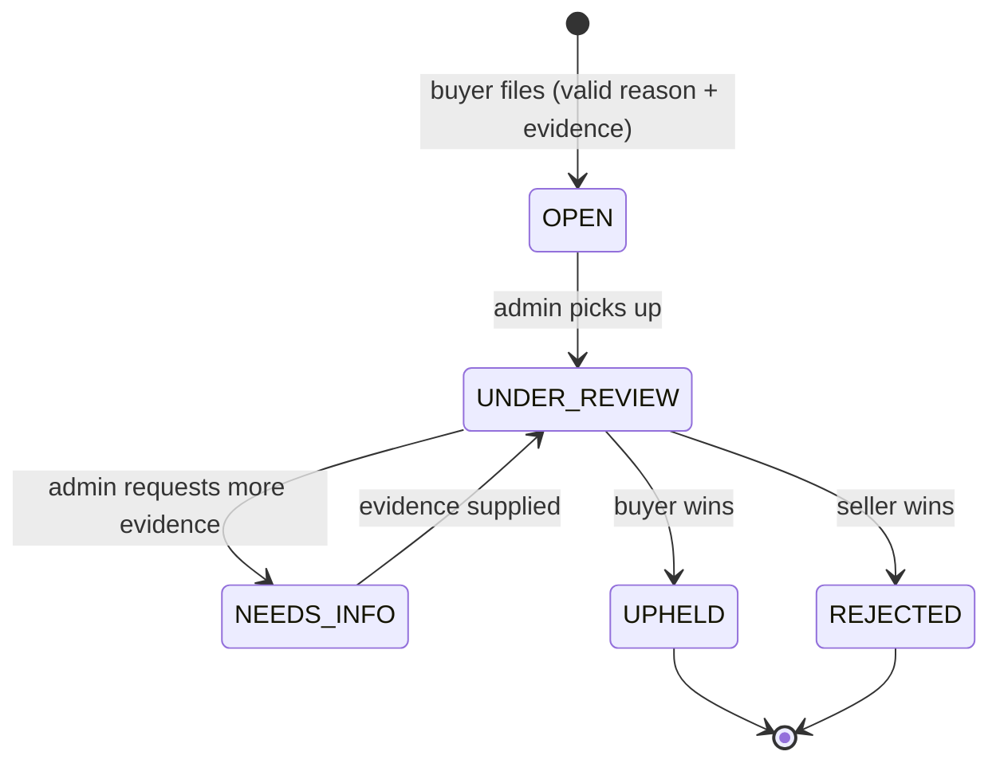

# Transaction State Machine Specification
## Beirut Premium Fashion Resale Marketplace — MVP

**Version:** v1
**Companion to:** `PRD_Beirut_Resale_Marketplace_MVP.md`
**Audience:** Developer + Claude Code (this is the build spec for the transaction core)
**Status:** Draft for implementation

> **Purpose.** This document defines the spine of the product: how an item moves
> from listed → offered → paid → shipped → delivered → released (or disputed). It is
> deliberately precise because **this is where money moves**. Every state, transition,
> guard, side effect, timer, and invariant is specified so the transaction core can be
> built without improvising the rules.
>
> **How to use it.** Implement the state machines exactly as defined. Treat the
> **Invariants** (§3) as non-negotiable assertions enforced in code and the database,
> not just conventions. Where a value is marked `{CONFIG}`, it's a tunable constant —
> see §4. Items marked **[CONFIRM]** are open decisions the founder should lock before
> or during build (collected in §13).

---

## 1. Entities & Relationships

```
Listing ──< Offer (thread) ──(accepted)──> Order ──1:1── Payment (funds hold)
                                              │
                                              ├──1:0..1── Shipment
                                              ├──1:0..1── Claim
                                              └──(on release)──1:1── Payout
```

- A **Listing** can receive many **Offers**. Offers form a negotiation **thread**
  (buyer offer → seller counter → buyer counter …) linked by `parent_offer_id`.
- Accepting an offer creates exactly one **Order**.
- An **Order** owns one **Payment** (the held funds), zero-or-one **Shipment**,
  zero-or-one **Claim**, and — once funds are released — one **Payout**.
- **Order state** and **Funds state** are tracked **separately** but constrained by
  each other (see invariants). This separation keeps "where is the item in the flow"
  distinct from "where is the money," which prevents a whole class of bugs.

---

## 2. State Machine Overview

There are five linked state machines:

| Machine | Tracks | Terminal states |
|---------|--------|-----------------|
| **Listing** | Availability of the item | `SOLD`, `REMOVED` |
| **Offer** | A single node in the negotiation thread | `ACCEPTED`, `REJECTED`, `WITHDRAWN`, `EXPIRED`, `SUPERSEDED` |
| **Order** | The transaction lifecycle | `COMPLETED`, `RESOLVED_RELEASE`, `RESOLVED_REFUND`, `CANCELLED` |
| **Funds** (Payment) | Where the money is | `RELEASED`, `REFUNDED`, `PARTIALLY_REFUNDED`, `VOID` |
| **Payout** | Paying the seller | `SENT`, `FAILED→(manual)` |

The **Order** machine is the orchestrator; it drives Listing, Funds, and Payout
transitions via side effects.

---

## 3. Global Invariants (enforce in code + DB)

These must hold at all times. Violations are bugs that can lose money.

1. **Single active order per listing.** A listing may have **at most one** order in a
   non-terminal state (`PENDING_PAYMENT` or `RESERVED`). This is the core double-sale
   guard, critical because inventory lives with sellers across channels.
2. **Funds are in exactly one place.** Funds are always in exactly one state:
   `PENDING | HELD | RELEASING | RELEASED | REFUNDING | REFUNDED | PARTIALLY_REFUNDED | VOID`.
   Funds can **never** be both released and refunded.
3. **No release while disputed.** Funds cannot enter `RELEASING`/`RELEASED` while a
   Claim is `OPEN` or `UNDER_REVIEW`.
4. **Release preconditions (all required):** delivery confirmed **AND** inspection
   window passed or buyer-confirmed **AND** no upheld/open claim **AND** (if the item
   is high-value) the authentication checkpoint passed.
5. **Claims are time-boxed.** A claim can only be opened while the order is in
   `INSPECTION` and before funds are released. The claim-check **must be evaluated
   before** the auto-complete timer fires (ordering rule — see §11).
6. **Idempotency.** All external webhooks (payment captured, payout settled) must be
   idempotent via an idempotency key; duplicate deliveries must not double-charge,
   double-release, or double-refund.
7. **USD only.** All amounts are USD. Payouts only go to a **verified fresh-USD**
   destination (post-Oct-2019 account/wallet).
8. **Everything is audited.** Every state transition writes an immutable audit entry:
   `{entity, id, from_state, to_state, actor, trigger, reason, timestamp}`.

---

## 4. Timers & Tunable Constants `{CONFIG}`

| Constant | Meaning | Suggested default | [CONFIRM] |
|----------|---------|-------------------|-----------|
| `OFFER_TTL` | How long an offer/counter stays open before expiring | 48h | ✔ |
| `PAYMENT_WINDOW` | Time buyer has to pay after seller accepts | 24h | ✔ |
| `SHIPMENT_SLA` | Time seller has to ship after funds held | 3 business days | ✔ |
| `DELIVERY_SLA` | Expected delivery window; triggers follow-up if exceeded | 5 business days | ✔ |
| `INSPECTION_WINDOW` | Buyer inspection period after delivery | 48h | ✔ |
| `PAYOUT_SLA` | Target time to pay seller after release | 24h | ✔ |
| `HIGH_VALUE_THRESHOLD` | Price at/above which auth checkpoint + pre-publish review apply | $600 | ✔ |
| `PAYOUT_MAX_RETRIES` | Auto-retries before payout escalates to manual | 3 | ✔ |

---

## 5. Listing State Machine

Controls whether an item is buyable and enforces double-sale prevention.



| State | Meaning |
|-------|---------|
| `DRAFT` | Seller composing; not visible to buyers. |
| `IN_REVIEW` | Submitted; awaiting admin review. **Mandatory** for items ≥ `HIGH_VALUE_THRESHOLD`; below-threshold items may auto-approve and be reviewed asynchronously. |
| `LIVE` | Visible; can receive offers. |
| `PENDING_PAYMENT` | **Soft lock.** An offer was accepted; blocks accepting other offers and blocks other buyers, while the buyer pays. |
| `RESERVED` | **Hard lock.** Funds held; item committed to this order. |
| `SOLD` | Order completed; funds released. Terminal. |
| `REMOVED` | Unlisted by seller, removed by admin, or rejected in review. Terminal. |

**Transition guards & side effects**

| From → To | Trigger / Actor | Guards | Side effects |
|-----------|-----------------|--------|--------------|
| DRAFT → IN_REVIEW | Seller submits | Min photo count met; condition grade set; brand/size/category/price present | Queue for review (or auto-approve if below threshold) |
| IN_REVIEW → LIVE | Admin approves (or auto) | Passed review | Listing becomes searchable |
| IN_REVIEW → REMOVED | Admin rejects | Reason required | Notify seller with reason |
| LIVE → PENDING_PAYMENT | Offer accepted | Listing is `LIVE` (invariant #1) | Start `PAYMENT_WINDOW`; supersede other pending offers ([CONFIRM] §13) |
| PENDING_PAYMENT → RESERVED | Payment held | Funds `HELD` | Hard-lock item |
| PENDING_PAYMENT → LIVE | `PAYMENT_WINDOW` expires | Funds not `HELD` | Offer → `EXPIRED`; relist |
| RESERVED → SOLD | Order `COMPLETED`/`RESOLVED_RELEASE` | Funds `RELEASING`/`RELEASED` | Close listing |
| RESERVED → LIVE | Order `CANCELLED`/`RESOLVED_REFUND` | Funds refunded/void | Relist ([CONFIRM]: relist vs review-first) |

---

## 6. Offer State Machine

Each offer/counter is a **node** in a thread. The thread alternates direction
(buyer→seller, then seller→buyer on a counter). Only one node is `PENDING` at a time —
the one awaiting the other party.



| State | Meaning |
|-------|---------|
| `PENDING` | Active node awaiting the other party's decision. |
| `ACCEPTED` | Receiver accepted → **creates the Order** (see §7). |
| `REJECTED` | Receiver declined this node; thread ends. |
| `SUPERSEDED` | Receiver countered; this node is replaced by a new `PENDING` node (the counter) awaiting the original proposer. |
| `WITHDRAWN` | Proposer pulled the offer before a response. |
| `EXPIRED` | `OFFER_TTL` elapsed with no response. |

**Key transition — PENDING → ACCEPTED** (the only one that creates an Order)

- **Actor:** the party receiving the active offer (seller accepting a buyer offer, or
  buyer accepting a seller counter).
- **Guards:** listing is `LIVE` (not already locked); this offer node is `PENDING` and
  not expired/withdrawn; accepting account is active.
- **Side effects:**
  1. Create **Order** in `AWAITING_PAYMENT` at the accepted amount.
  2. Listing → `PENDING_PAYMENT`.
  3. Other `PENDING` offers on the same listing → `SUPERSEDED` ([CONFIRM] §13: hard-supersede vs hold-and-reactivate if the deal falls through).
  4. Start `PAYMENT_WINDOW` timer; notify the buyer to pay.

---

## 7. Order State Machine (Core)

The orchestrator. Drives funds, listing, shipment, claim, and payout.



### 7.1 States

| State | Meaning | Funds state |
|-------|---------|-------------|
| `AWAITING_PAYMENT` | Order created on acceptance; buyer must pay within `PAYMENT_WINDOW`. | `PENDING` |
| `AWAITING_SHIPMENT` | Payment captured & held; seller must ship within `SHIPMENT_SLA`. | `HELD` |
| `SHIPPED` | Seller confirmed shipment + uploaded proof; in transit. | `HELD` |
| `INSPECTION` | Delivered; buyer's inspection window open. | `HELD` |
| `CLAIM_OPEN` | Buyer filed a valid claim; funds frozen. | `HELD` (frozen) |
| `UNDER_REVIEW` | Admin investigating the claim. | `HELD` (frozen) |
| `ADMIN_HOLD` | Seller missed `SHIPMENT_SLA`; awaiting admin decision (money is held, so never auto-cancel silently). | `HELD` |
| `COMPLETED` | Success: buyer satisfied / window passed. Funds released. **Terminal.** | `RELEASING`→`RELEASED` |
| `RESOLVED_RELEASE` | Claim rejected; seller paid. **Terminal.** | `RELEASING`→`RELEASED` |
| `RESOLVED_REFUND` | Claim upheld; buyer refunded (full or partial). **Terminal.** | `REFUNDED`/`PARTIALLY_REFUNDED` |
| `CANCELLED` | Fell through before shipment (no payment, or admin cancel). **Terminal.** | `VOID`/`REFUNDED` |

### 7.2 Transition table (trigger · actor · guards · side effects · timer)

| # | From → To | Trigger / Actor | Guards | Side effects | Timer started |
|---|-----------|-----------------|--------|--------------|---------------|
| 1 | (create) → AWAITING_PAYMENT | Offer accepted / system | Listing `LIVE` | Lock listing → `PENDING_PAYMENT`; funds=`PENDING`; notify buyer | `PAYMENT_WINDOW` |
| 2 | AWAITING_PAYMENT → AWAITING_SHIPMENT | Payment-held webhook / system | Amount == agreed + fees; **idempotent**; window not expired | funds=`HELD`; listing → `RESERVED`; notify seller to ship | `SHIPMENT_SLA` |
| 3 | AWAITING_PAYMENT → CANCELLED | `PAYMENT_WINDOW` expires or payment fails / system | Funds not `HELD` | funds=`VOID`; listing → `LIVE`; offer → `EXPIRED`; notify both | — |
| 4 | AWAITING_SHIPMENT → SHIPPED | Seller confirms ship / seller | funds=`HELD`; **shipment proof present** (courier + tracking + sealed-package/pickup photo) | Create Shipment; notify buyer | `DELIVERY_SLA` |
| 5 | AWAITING_SHIPMENT → ADMIN_HOLD | `SHIPMENT_SLA` expires / system | No shipment recorded | Flag to admin; notify seller (nudge) | — |
| 6 | ADMIN_HOLD → SHIPPED | Seller ships late, admin allows / seller+admin | Shipment proof present | Create Shipment; notify buyer | `DELIVERY_SLA` |
| 7 | ADMIN_HOLD → CANCELLED | Admin cancels / admin | Reason logged | funds → `REFUNDING` → `REFUNDED`; listing → `LIVE`/`REMOVED`; seller standing impacted; notify both | — |
| 8 | SHIPPED → INSPECTION | Delivery confirmed (courier status, buyer marks received, or `DELIVERY_SLA` + proof) / courier·buyer·system | Shipment exists | Record `delivered_at` + delivery proof; notify buyer "inspect now" | `INSPECTION_WINDOW` |
| 9 | INSPECTION → COMPLETED | Buyer confirms **or** `INSPECTION_WINDOW` expires / buyer·system | **No open claim**; auth-check passed if high-value (inv. #4) | funds → `RELEASING`; create Payout(`PENDING`); listing → `SOLD`; enable buyer rating; notify seller | `PAYOUT_SLA` |
| 10 | INSPECTION → CLAIM_OPEN | Buyer files claim / buyer | Within `INSPECTION_WINDOW`; funds=`HELD`; reason ∈ {counterfeit, wrong_item, major_misdescription}; **evidence attached** (unboxing video required) | **Freeze funds**; pause completion timer; create Claim(`OPEN`); notify seller + admin | `CLAIM_RESPONSE_SLA` |
| 11 | CLAIM_OPEN → UNDER_REVIEW | Admin picks up / admin | — | Assemble evidence bundle (listing snapshot, shipping proof, unboxing video, auth record) | — |
| 12 | UNDER_REVIEW → RESOLVED_REFUND | Admin upholds (full/partial) / admin | Decision + reason logged | funds → `REFUNDING` → `REFUNDED` (full) or `PARTIALLY_REFUNDED` (split); return logistics per case; seller liability/standing impacted; notify both | — |
| 13 | UNDER_REVIEW → RESOLVED_RELEASE | Admin rejects / admin | Decision + reason logged | funds → `RELEASING`; create Payout(`PENDING`); listing → `SOLD`; notify both | `PAYOUT_SLA` |

---

## 8. Funds (Payment) State Machine

Tracked on the `Payment` entity, driven by Order side effects.



| State | Meaning |
|-------|---------|
| `PENDING` | Awaiting buyer payment. |
| `HELD` | Captured and held by the platform (the "secure hold"). |
| `RELEASING` | Release approved; payout in progress. |
| `RELEASED` | Paid out to seller. Terminal. |
| `REFUNDING` | Refund approved; in progress. |
| `REFUNDED` | Returned to buyer in full. Terminal. |
| `PARTIALLY_REFUNDED` | Split: part to buyer, remainder released to seller. Terminal. |
| `VOID` | Never captured (window expired / failed). Terminal. |

> **Note on "secure hold, not legal escrow":** in v1 the platform collects via the
> partner gateway and holds funds in its own controlled account, releasing on the Order
> machine's trigger. The regulatory framing of holding third-party funds is an open risk
> (PRD §18.1) — but the *state logic* above is independent of how the hold is legally
> structured.

---

## 9. Payout State Machine

Created when funds enter `RELEASING`. Pays the seller in fresh USD.



| State | Meaning |
|-------|---------|
| `PENDING` | Queued for payout. |
| `PROCESSING` | Sent to payment partner; awaiting settlement confirmation. |
| `SENT` | Settlement confirmed → set Funds `RELEASED`, Order terminal. |
| `FAILED` | Partner returned an error; auto-retry up to `PAYOUT_MAX_RETRIES`. |
| `MANUAL` | Retries exhausted → **escalate to admin (P0)**. Per PRD, payout failures are treated as P0 incidents. |

---

## 10. Claim State Machine



| State | Meaning | Drives Order to |
|-------|---------|-----------------|
| `OPEN` | Filed within inspection window; funds frozen. | `CLAIM_OPEN` |
| `UNDER_REVIEW` | Admin investigating. | `UNDER_REVIEW` |
| `NEEDS_INFO` | Awaiting more evidence from a party (timer; auto-decision if unmet — [CONFIRM]). | `UNDER_REVIEW` |
| `UPHELD` | Buyer prevails → refund (full/partial); seller liability recorded. | `RESOLVED_REFUND` |
| `REJECTED` | Seller prevails → release. | `RESOLVED_RELEASE` |

**Eligible claim reasons (only these):** `counterfeit`, `wrong_item`, `major_misdescription`.
Change of mind, minor wear consistent with grade, and buyer's remorse are **not**
eligible — final sale is the default.

**Evidence backbone (validity requirements):** unboxing video + the issue description
are required for a claim to be valid; admin adjudicates against the listing snapshot,
the seller's shipping/seal proof, and (if applicable) the authentication record.

---

## 11. Edge Cases & Concurrency Rules

1. **Accept race (two buyers).** Two offers accepted near-simultaneously: only the first
   passes the `listing == LIVE` guard and locks it (invariant #1). The second fails with
   "item no longer available." Enforce with a DB-level conditional update / row lock on
   the listing, not just app logic.
2. **Late payment after window.** If `PAYMENT_WINDOW` expired and the order was
   `CANCELLED`, but a payment webhook lands afterward: **auto-refund** the buyer; do not
   resurrect the order. Reconciliation job catches stragglers.
3. **Duplicate webhooks.** Payment-held and payout-settled webhooks may be delivered
   more than once. Use an idempotency key per event; a second delivery is a no-op
   (invariant #6).
4. **Claim at the buzzer.** A claim filed in the final seconds of `INSPECTION` must
   freeze funds **before** the auto-complete timer can fire. Rule: the completion job
   must re-check "no open claim" inside the same transaction that releases funds; if a
   claim exists, abort release. (Claim-check precedes completion.)
5. **Non-delivery dispute.** Buyer claims "never arrived" while seller has shipping
   proof: adjudicate using courier status + sealed-package proof. This is exactly why
   chain-of-custody evidence (PRD §10) is mandatory.
6. **Item-swap fraud.** Buyer swaps in their own fake and claims counterfeit: the
   unboxing-video requirement + seller seal proof are the evidentiary defense. Pattern
   detection on repeat claimants (anti-abuse).
7. **Partial refund math.** On `PARTIALLY_REFUNDED`, define the split explicitly:
   `refund_to_buyer + release_to_seller == amount_held` (commission handling on partials
   is [CONFIRM] §13).
8. **Seller ships then cancels / buyer disappears at inspection.** If buyer never
   confirms, `INSPECTION_WINDOW` expiry auto-completes (release). This is intended:
   silence = acceptance after the window.
9. **Repeated payout failure.** Order stays effectively closed on the buyer side but
   Funds remain `RELEASING` with Payout `MANUAL` until ops resolves; never mark
   `RELEASED` until settlement confirmed.

---

## 12. Notifications (minimum set)

Trigger a notification (WhatsApp/SMS/email per PRD §21) on each of these:

- Offer received / countered / accepted / rejected / expiring soon (to the relevant party).
- Payment required (acceptance) + payment window expiring.
- Payment received → ship now (seller); shipment SLA nudge.
- Shipped (buyer) + delivered → inspect now (buyer) + inspection window closing.
- Order completed / payout sent (seller).
- Claim opened (seller + admin) / claim resolved (both).
- Payout failed → admin (P0).

---

## 13. Open Decisions to Confirm (before/at build) `[CONFIRM]`

1. **Listing lock point.** Confirmed approach: soft-lock on acceptance
   (`PENDING_PAYMENT`), hard-lock on payment (`RESERVED`). Confirm this matches intended
   behavior.
2. **Other pending offers on acceptance.** Hard-supersede them, or hold and reactivate
   if the accepted deal falls through within the payment window? (Simpler = supersede.)
3. **All timer values** in §4 (`OFFER_TTL`, `PAYMENT_WINDOW`, `SHIPMENT_SLA`,
   `INSPECTION_WINDOW`, `PAYOUT_SLA`, etc.).
4. **`HIGH_VALUE_THRESHOLD`** and what the auth checkpoint actually is (in-house,
   partner, photo protocol).
5. **Relist after refund/cancel:** straight back to `LIVE`, or back through
   `IN_REVIEW` first?
6. **Partial-refund commission rule:** does the platform take commission on the
   seller-released portion of a partial?
7. **`NEEDS_INFO` timeout behavior:** auto-decide for which party if evidence isn't
   supplied in time?
8. **Delivery confirmation source of truth:** courier API status, buyer tap, or both
   (and precedence)?

---

## 14. Implementation Notes for Claude Code

- Model each machine as an explicit `status` enum + a transition function that takes
  `(currentState, event)` and returns `(nextState, sideEffects)` — **reject any
  transition not in the table** (no implicit transitions).
- Enforce invariant #1 (single active order per listing) and the accept-race with a
  **DB constraint or conditional update**, not just application code.
- Make payment/payout webhook handlers **idempotent** (idempotency key table).
- Run timers as **scheduled jobs** (payment-window expiry, shipment SLA, inspection
  auto-complete, payout retry). The inspection auto-complete job must re-check
  "no open claim" inside the release transaction (edge case #4).
- Write an **audit row on every transition** (invariant #8). This doubles as the admin
  Orders/Offers monitor and dispute evidence trail.
- Keep **Order state** and **Funds state** as separate columns; never infer one solely
  from the other — cross-check them against the invariants.

---

*End of Transaction State Machine Spec v1.*
